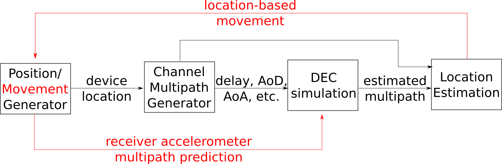

# CASTRO-5G

This Open Source repo presents a collection of 5G sparse multipath channel simulation, estimation and location signal processing tools in Python. CASTRO-5G is a repository started as a means to publish the software results of the research project Communications And Spatial Tracking RatiO (CASTRO) funded by Spanish Ministerio de Ciencia e Innovación (MICINN) - Proyectos de Generación de Conocimiento 2021 PID2021-122483OA-I00. The project is part of the [AtlanTTic](atlanttic.uvigo.es/) research center at University of Vigo.

## How to contribute

Please read [CONTRIBUTING.md](CONTRIBUTE.md) for details on our code of conduct, and the process for submitting pull requests to us.

## Versions

* Version [0.0.1](https://github.com/gomezcuba/CASTRO-5G/commit/4bec7196ccf48104f0ba5c6844e80f751b8f4db1) - initialized a private github repo with [gomezcuba](https://github.com/gomezcuba)'s draft code, which was still very deficient
* Version [0.0.2](https://github.com/gomezcuba/CASTRO-5G/commit/2cdb85b31b8327e2401333abb74ab661c051118a) - [gonzaFero](https://github.com/gonzaFero) finished his TFG, upgrading MultipathLocationEstimator.py and creating its tutorials
* Version [0.1.0 (current release)](https://github.com/gomezcuba/CASTRO-5G/releases/tag/v0.1.0-alpha.multipathlocationlibrary) - [gomezcuba](https://github.com/gomezcuba) prepared the repo for going public, 
* Version 0.1.1 (upcoming) - [iagoalvarez](https://github.com/iagoalvarez) is finishing his TFG, upgrading threeGPPMultipathGenerator.py and creating its test files

## Authors

* **Felipe Gomez Cuba** - *Initial work and and release integration* - [gomezcuba](https://github.com/gomezcuba) - [website](https://www.felipegomezcuba.info/)
* **Gonzalo Feijoo Rodriguez (TFG)** - *Multipath Location module v2 and tutorials* - [gonzaFero](https://github.com/gonzaFero)
* **Iago Dafonte (TFG)** - *3GPP Channel Generator module v2 and example files* - [iagoalvarez](https://github.com/iagoalvarez)

See also the list of [contributors](https://github.com/your/project/contributors) actively submitting to this project.

## Getting Started

To get a copy of the code up and running on a local folder follow the steps below. See the [Deployment](#deployment) section for notes on how to deploy the project on a live system.

### Prerequisites

Our project aims to maintain a reduced number of dependencies. On a standard python3 install, you would only need to intall the following libraries according to your preferred installation method.

* [Numpy](https://numpy.org/)
* [Scipy](https://scipy.org/)
* [Matplotlib](https://matplotlib.org/)
* (Our roadmap foresees including [Pandas](https://pandas.pydata.org/) as a default dependency, as it can enable a very elegant storage of multipath data. This may become a prerequisite in the future. Currently, the code can be run without this dependency. However, we highly recommend to have Pandas installed from the begining of your work, specially if you plan to upgrade to next versions of CASTRO-5G)

### Installing

You may simply download the code into a folder or clone the repo

```
git clone https://github.com/gomezcuba/CASTRO-5G.git
```

You can test that dependencies are met by running the *raygeometry.py* simulation

```
python raygeometry.py
```

the expected result is that this script should run without warnings, print several debug lines, and generate several .eps results files in the working folder.

## Structure of the Code



The aim the repo CASTRO-5G is the simulation of the interplays between location and communications in multipath channels. For this, there are four high level  

* Establish the device locatios. The current release does not provide advanced location models. Static user locations may be selected by the simulation scripts. For example, a fixed topology may be used to test algorithms, or random user locations may be used in monte-carlo simulations. Mobility is not currently supported.

```
x0_true=np.random.rand(1)*40-10
y0_true=np.random.rand(1)*40-10
```

* Generate the actual multipath channel data. The current version of the code provides a draft implementation of the 3GPP UMi channel model without spatial consistency. Support for spatial consistency and other scenarios is currently under development.

```
import threeGPPMultipathGenerator

chgen = threeGPPMultipathGenerator.ThreeGPPMultipathChannelModel()
mpch = chgen.create_channel((0,0,10),(x0_true,y0_true,1.5))
```

* Simulate communications in a Discrete Equivalent Channel (DEC) according to the channel model, possibly featuring multipath data estimation. The current version of the code provides a draft implementation of the OMPBR Compressed Sensing algorithm for a single-user Hybrid BeamForming (HBF) MIMO OFDM channel. Auxiliar classes are provided for the generation of the DEC channel impulse response, the antenna array responses, and the generation of HBF MIMO pilots. Additional CS channel estimation algorithm and general code improvements are in active development.

```
import multipathChannel
ht=mpch.getDEC(Na,Nd,Nt,Ts)
hk=np.fft.fft(ht.transpose([2,0,1]),Kfft,axis=0) %this reshape will be avoided in future updates
...
import MIMOPilotChannel
pilgen = pil.MIMOPilotChannel("UPhase")
(txPilot,rxPilot)=pilgen.generatePilots(dimensions,)
yp=pilgen.applyPilotChannel(hk,txPilot,rxPilot,noise)
...
import OMPCachedRunner
omprunner = OMPCachedRunner.OMPCachedRunner()
estimation = omprunner.OMPBR(y,xi,cacheID,txPilot,rxPilot,delayOversampling,aodOversampling,aoaOversampling,brOversampling)
```

* Estimate the location of the receiver, relative to the transmitter position, from the multipath information (exact or estimated). It must be noted that the "proper" 3GPP channel model does not produce multipath results according to the assumptions of the location algorithm. An adaptation is in active development.

```
import MultipathLocationEstimator
loc=MultipathLocationEstimator.MultipathLocationEstimator()
estimatedLocationData = loc.computeAllLocationsFromPaths(AoDs, AoAs, dels)
```

## Tests, Examples and Tutorials

TBW

## Deployment

The following files can be added to your PATH and employed as python libraries or shell commands

* multipathChannel.py
* threeGPPMultipathGenerator.py
* OMPCachedRunner.py
* mpraylocsim.py

##  Publications

* F. Gómez-Cuba, "Compressed Sensing Channel Estimation for OTFS Modulation in Non-Integer Delay-Doppler Domain," 2021 IEEE Global Communications Conference (GLOBECOM), 2021,
* F. Gómez-Cuba, G. Feijoo-Rodríguez, N. González-Prelcic "Clock and Orientation-Robust Simultaneous Radio Localization and Mapping at Millimeter Wave Bands" Accepted for publication in IEEE WCNC 2023, Glasgow, Scotland.

###  [TFGs](https://teleco.uvigo.es/es/estudos/organizacion-academica/tfg-tfm/)

* Gonzalo Feijoo Rodríguez, "Implementación de un algoritmo de localización de usuarios empleando señales 5G en lenguaje Python"

##  Acknowledgments

### OSS

* [Numpy](https://numpy.org/)
* [Scipy](https://scipy.org/)
* [Matplotlib](https://matplotlib.org/)
* [Spyder3](https://www.spyder-ide.org/)

### Featured Research

* The OMPBR Compressed Sensing algorithm was first discussed in: F. Gómez-Cuba and A. J. Goldsmith, "Compressed Sensing Channel Estimation for OFDM With Non-Gaussian Multipath Gains," in IEEE Transactions on Wireless Communications, vol. 19, no. 1, pp. 47-61, Jan. 2020
* The 3GPP channel model is defined in: 3GPP. (2022). 3rd Generation Partnership Project; Technical Specification Group Radio Access Network; Study on channel model for frequencies from 0.5 to 100 GHz (Release 17). ETSI TR 38.901, 17.0.
1
## License

This project is licensed under the GPLv3 license - see the [LICENSE](LICENSE) file for details