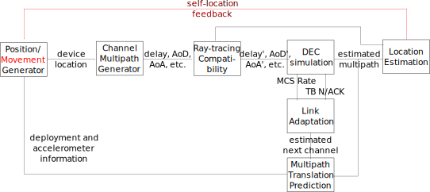

# CASTRO-5G

This Open Source repo presents a collection of 5G sparse multipath channel simulation, estimation and location signal processing tools in Python. CASTRO-5G is a repository started as a means to publish the software results of the research project Communications And Spatial Tracking RatiO (CASTRO) funded by Spanish Ministerio de Ciencia e Innovación (MICINN) - Proyectos de Generación de Conocimiento 2021 PID2021-122483OA-I00. The project is part of the [AtlanTTic](atlanttic.uvigo.es/) research center at University of Vigo.

## How to contribute

Please read [CONTRIBUTING.md](CONTRIBUTE.md) for details on our code of conduct, and the process for submitting pull requests to us.

## Versions

* Version [0.0.1](https://github.com/gomezcuba/CASTRO-5G/commit/4bec7196ccf48104f0ba5c6844e80f751b8f4db1) - initialized a private github repo with [gomezcuba](https://github.com/gomezcuba)'s draft code, which was still very deficient
* Version [0.0.2](https://github.com/gomezcuba/CASTRO-5G/commit/2cdb85b31b8327e2401333abb74ab661c051118a) - [gonzaFero](https://github.com/gonzaFero) finished his TFG, upgrading MultipathLocationEstimator.py and creating its tutorials
* Version [0.1.0](https://github.com/gomezcuba/CASTRO-5G/releases/tag/v0.1.0-alpha.multipathlocationlibrary) - [gomezcuba](https://github.com/gomezcuba) prepared the repo for going public, 
* Version [0.1.1](https://github.com/gomezcuba/CASTRO-5G/commit/cb1310b779897ac864780a305b1d415b6ecc48d9) - [iagoalvarez](https://github.com/iagoalvarez) finished his TFG, upgrading threeGPPMultipathGenerator.py and creating its test files
* Version [0.1.2](https://github.com/gomezcuba/CASTRO-5G/commit/fd4cb8a4e868ae48db633350e20564a11be52962) - [gts-99](https://github.com/gts-99) finished his TFG, upgrading the IoTSpatialConsistencyExperimentthreeGPPMultipathGenerator.py to simulate a multi-user system with link adaptation
* Version [0.2.0](https://github.com/gomezcuba/CASTRO-5G/releases/tag/v0.2.0-alpha.3gpp) - [gomezcuba](https://github.com/gomezcuba) refactored the code to return values as Pandas Dataframes and support clusters with variable number of subpaths and prepared the new release version

## Authors

* **Felipe Gomez Cuba** - *Initial work and and release integration* - [gomezcuba](https://github.com/gomezcuba) - [website](https://www.felipegomezcuba.info/)
* **Gonzalo Feijoo Rodriguez (TFG)** - *Multipath Location module v2 and tutorials* - [gonzaFero](https://github.com/gonzaFero)
* **Iago Alvarez Ramos (TFG)** - *3GPP Channel Generator module v2 and example files* - [iagoalvarez](https://github.com/iagoalvarez)
* **Guillermo Tomás Sancho Camacho(TFG)** - *Multi-user Link Adaptation simulations* - [gts-99](https://github.com/gts-99)
* **Uxía Tarrío Pinazas (TFG)** - *3GPP Channel Generator extension for ray-tracing* - [uxxiat](https://github.com/uxxiat)
* **Ana María Vidal García (TFG)** - *3GPP Channel Generator extension for spatial consistency* - [anavidgar](https://github.com/anavidgar)

See also the list of [contributors](https://github.com/your/project/contributors) actively submitting to this project.

## Getting Started

To get a copy of the code up and running on a local folder follow the steps below. See the [Deployment](#deployment) section for notes on how to deploy the project on a live system.

### Prerequisites

Our project aims to maintain a reduced number of dependencies. On a standard python3 install, you would only need to intall the following libraries according to your preferred installation method.

* [Numpy](https://numpy.org/)
* [Scipy](https://scipy.org/)
* [Matplotlib](https://matplotlib.org/)
* [Pandas](https://pandas.pydata.org/)
* [Progress](https://pypi.org/project/progress/)

### Installing

You may simply download the code into a folder or clone the repo

```
git clone https://github.com/gomezcuba/CASTRO-5G.git
```

You can test the location module by running the *raygeometry.py* simulation

```
python raygeometry.py
```

the expected result is that this script should run without warnings, print several debug lines, and generate several .eps results files in the working folder.

You can test the channel generator by running the *plotAzimutDelay4D.py* script

```
python plotAzimutDelay4D.py
```

the expected result is that this script should run without warnings.

You can test the link adaptation model by running the *IoTSpatialConsistencyExperiment.py* script

```
python IoTSpatialConsistencyExperiment.py
```

the expected result is that this script should run without warnings, simulate a multi-user mmWave network, and display several plots with the time-varying throughput of the devices.

## Structure of the Code



The aim the repo CASTRO-5G is the simulation of the interplays between location and communications in multipath channels. For this, there are four high level functionalities that must be implemented

* Modeling the devide locations 
* Generation of multipath channel parameters
* Simulation of a Discrete Equivalent Channel
* Estimation of the location

In the location estimation problem, the four functionalities are connected in an open loop (locations are inputs to the channel generator, and so on...). The Link Adaptation model takes the opposite approach: achievable rate vs outage is simultated in a multi-user mmwave network, where channel prediction based on the inter-user separation is exploited for channel estimation. Currently these two research experiments are conducted with a simplified multipath generator, whereas the 3GPP generator is under active development and will replace the placeholder in a future release.

### Modeling the device locations

The current release does not provide advanced location models. Static user locations may be selected by the simulation scripts. For example, a fixed topology may be used to test algorithms, or random user locations may be used in monte-carlo simulations. Mobility is not currently supported.

```
x0_true=np.random.rand(1)*40-10
y0_true=np.random.rand(1)*40-10
```

### Simulation of the DEC communications

Simulation should use a DEC according to the multipath data, possibly featuring a channel estimation. The current version of the code provides a draft implementation of the OMPBR Compressed Sensing algorithm for a single-user Hybrid BeamForming (HBF) MIMO OFDM channel. Auxiliar classes are provided for the generation of the DEC channel impulse response, the antenna array responses, and the generation of HBF MIMO pilots. Additional CS channel estimation algorithm and general code improvements are in active development.

```
import multipathChannel
ht=mpch.getDEC(Na,Nd,Nt,Ts)
hk=np.fft.fft(ht.transpose([2,0,1]),Kfft,axis=0) %this reshape will be avoided in future updates
...
import MIMOPilotChannel
pilgen = pil.MIMOPilotChannel("UPhase")
(txPilot,rxPilot)=pilgen.generatePilots(dimensions,)
yp=pilgen.applyPilotChannel(hk,txPilot,rxPilot,noise)
...
import OMPCachedRunner
omprunner = OMPCachedRunner.OMPCachedRunner()
estimation = omprunner.OMPBR(y,xi,cacheID,txPilot,rxPilot,delayOversampling,aodOversampling,aoaOversampling,brOversampling)
```

### Estimation of the location

The location of the receiver, relative to the transmitter position, is computed from the multipath information (exact or estimated). It must be noted that the "proper" 3GPP channel model does not produce multipath results according to the assumptions of the location algorithm. An adaptation is in active development. The current release provides an implementation of the location algorithm we designed in the [WCNC paper](#Publications)

```
import MultipathLocationEstimator
loc=MultipathLocationEstimator.MultipathLocationEstimator()
estimatedLocationData = loc.computeAllLocationsFromPaths(AoDs, AoAs, dels)
```

### 3GPP Multipath generation

The current version of the code implements the 3GPP channel model for all scenarios without spatial consistency. Support for spatial consistency is currently under development. Extensions to generatre first-order reflections for location algorithms compatible with ray-tracing are under development.

```
import threeGPPMultipathGenerator as mpg

model = mpg.ThreeGPPMultipathChannelModel(scenario="UMi")
plinfo,macro,clusters,subpaths = model.create_channel((0,0,10),(40,0,1.5))
clusters 
            tau      powC         AOA        AOD         ZOA         ZOD
0  0.000000e+00  0.764448  180.000000   0.000000 -101.996899  281.907603
1  2.759884e-08  0.073687   83.024832 -25.268220  -94.168405  286.172831
2  3.572653e-08  0.020868  299.926267 -26.299873  -90.562823  288.074835
3  4.101559e-08  0.056501   87.875174 -16.139711 -110.023784  286.312376
4  1.019774e-07  0.005411   44.749012 -49.485415  -86.689676  274.191374
5  1.334950e-07  0.035079   71.443084 -41.279409  -91.396195  287.409881
6  1.467797e-07  0.022468   61.589224  55.494319 -114.064164  275.676571
7  1.649681e-07  0.011642   53.728117  58.258044  -88.938730  288.495474
8  2.860136e-07  0.005345   34.508513  64.938880 -118.197354  290.877719
9  3.924972e-07  0.004089   40.990608 -46.222464  -84.761340  291.190684
```

## Tests, Examples and Tutorials

### Location

* Jupyter tutorials [1](Tutorial_1_MultipathLocationEstimator.ipynb) [2](Tutorial_2_MultipathLocationEstimator.ipynb)
* Experimental files [1](raygeometry_flat.py) [2](raygeometry_2D.py) [3](raygeometry.py) [4](raygeosim.py) [5](plotPhi0Method.py)
* [Complete system simulator](mpraylocsim.py)

### 3GPP channel generator

* [Main channel generator library](threeGPPMultipathGenerator.py)
* Propagation condition examples [1](los.py) [2](pruebasPathloss.py) [3](macro.py) 
* Multipath channel impulse response examples [1](plotDelayChan.py) [2](plotArrayPolar.py) [3](plot2DUPAArray.py) [4](plot2MIMOArrays.py) [5](plotAoADelay.py) [6](plotAzimutDelay4D.py)
* Statistical validation [1](histogram.py)

### Link Adaptation

* [Basic simulation script](IoTSpatialConsistencyExperiment.py)

## Deployment

The following files can be added to your PATH and employed as python libraries or shell commands

* multipathChannel.py
* threeGPPMultipathGenerator.py
* OMPCachedRunner.py
* mpraylocsim.py

##  Publications

* F. Gómez-Cuba, "Compressed Sensing Channel Estimation for OTFS Modulation in Non-Integer Delay-Doppler Domain," 2021 IEEE Global Communications Conference (GLOBECOM), 2021,
* F. Gómez-Cuba, G. Feijoo-Rodríguez, N. González-Prelcic "Clock and Orientation-Robust Simultaneous Radio Localization and Mapping at Millimeter Wave Bands" Accepted for publication in IEEE WCNC 2023, Glasgow, Scotland.

###  [TFGs](https://teleco.uvigo.es/es/estudos/organizacion-academica/tfg-tfm/)

* Gonzalo Feijoo Rodríguez, "Implementación de un algoritmo de localización de usuarios empleando señales 5G en lenguaje Python"
* Iago Alvarez Ramos, "Implementación de un simulador de canales 5G en lenguaje Python"
* Guillermo Tomás Sancho Camacho(TFG), "Implementación de un algoritmo de Adaptación de Enlace / Control de Congestión para comunicaciones multiusuario de máquina a máquina utilizando el lenguaje Python"

##  Acknowledgments

### OSS

* [Numpy](https://numpy.org/)
* [Scipy](https://scipy.org/)
* [Matplotlib](https://matplotlib.org/)
* [Spyder3](https://www.spyder-ide.org/)

### Featured Research

* The OMPBR Compressed Sensing algorithm was first discussed in: F. Gómez-Cuba and A. J. Goldsmith, "Compressed Sensing Channel Estimation for OFDM With Non-Gaussian Multipath Gains," in IEEE Transactions on Wireless Communications, vol. 19, no. 1, pp. 47-61, Jan. 2020
* The 3GPP channel model is defined in: 3GPP. (2022). 3rd Generation Partnership Project; Technical Specification Group Radio Access Network; Study on channel model for frequencies from 0.5 to 100 GHz (Release 17). ETSI TR 38.901, 17.0.
1
## License

This project is licensed under the GPLv3 license - see the [LICENSE](LICENSE) file for details
